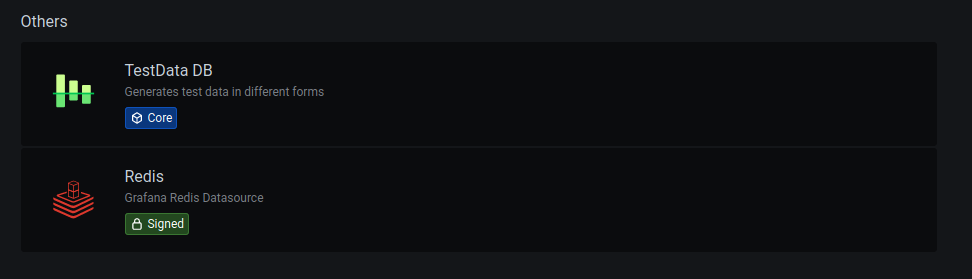
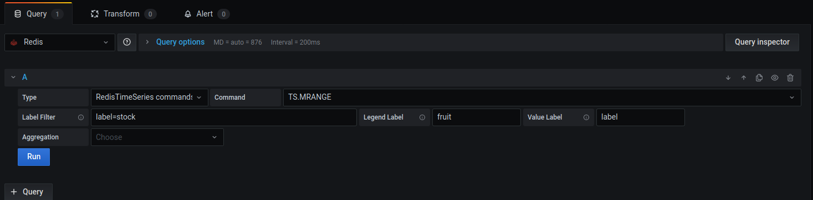
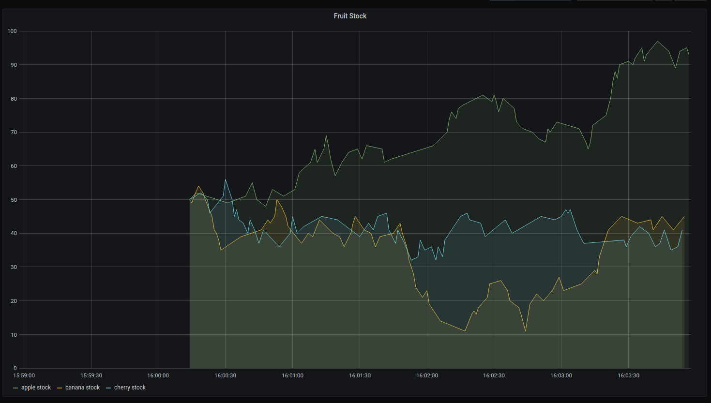
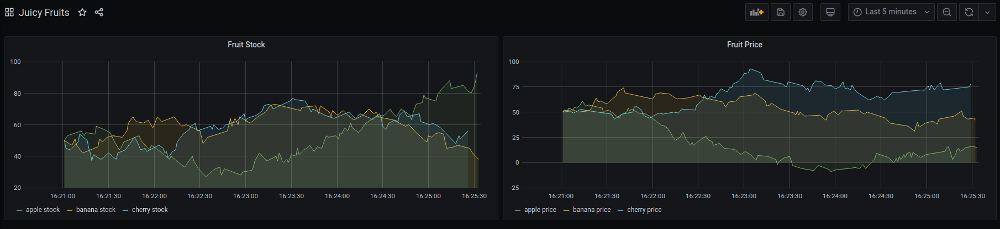

# Grafana with Redis Plugin


## Intro

[Redis](https://redis.io/) is a wonderful distributed key-value datastore, useful for facilitating information across services.

[Grafana](https://grafana.com/) is a fantastic tool for visualizing time series data in real time, useful for monitoring business-critical metrics.

Unfortunately, Grafana does not natively come packaged with Redis as a datasource. This would generally entail the usage of a thirdparty data collector such as InfluxDB or Prometheus.

Fortunately, the team at Redis Labs have developed an [official Redis plugin](https://grafana.com/grafana/plugins/redis-datasource) for Grafana, using their own [RedisTimeSeries project](https://github.com/RedisTimeSeries/grafana-redis-datasource#templates-variables).


## Testing this integration

This article will detail the testing of the integration of this plugin into Grafana. 
As dummy data, I've chosen to monitor the metrics of various fruits.
Specifically, I'll be monitoring the rapidly fluctuating **stock** and **price** of: *apples*, *bananas*, and *cherries*. 

In this test, everything will run in docker containers in a single docker-compose, so we don't have to worry about installing any thirdparty dependencies 
(except for, of course, docker, but that should be on every developer's machine :^))

The source code for this test can be found [here](https://github.com/kraxx/grafana-redis-test)

```yaml 
# https://github.com/kraxx/grafana-redis-test/blob/master/docker-compose.yml

version: "3.3"
services:

  redis:
    image: redislabs/redistimeseries
    ports:
      - 6379:6379
    network_mode: host

  grafana:
    image: grafana-with-redis-plugin
    depends_on:
      - redis
    ports:
      - 3000:3000
    network_mode: host
    volumes:
      - ./grafana/:/etc/grafana/provisioning/

  python_script:
    image: python:alpine
    depends_on:
      - redis
    network_mode: host
    volumes:
      - ./script/:/etc/my-script/
    command: >
      sh -c "pip install -r /etc/my-script/requirements.txt &&
      python3 /etc/my-script/redis_insert.py"
```

## RedisTimeSeries

RedisTimeSeries is a time series database built on top of Redis. 
We can interact with it pretty much the same way we do with Redis, 
but with the addition of the `TS` commands.

Commands prepended with `TS` are associated with creating key-value pairs associated
with a time series. A timestamp is generally included, with `*` being the current time.

As per usual, redistimeseries exposes port `6379` for its outgoing db connection. 
This redistimeseries instance is launched as `redis` in our docker-compose.yml.


## Redis Script

I've written a simple python script that:
1) Connects to the Redis instance.
2) Creates 6 keys: a stock for each fruit in the format of `stock:fruit`, 
and a price in the format of `price:fruit`. All values initiated at `50` for simplicity.
The keys will additionally be labeled (for filtering in Redis) with the following:
    1) `label` : `(stock|price)`
    2) `fruit` : `(apple|banana|cherry)`
3) Runs a loop that, for every `1 second`:
    1) *randomly* increments/decrements a *random* `fruit`'s **stock**
    2) *randomly* increments/decrements a *random* `fruit`'s **price**

This file is copied to a python:alpine docker image and ran from there.
In our docker-compose.yml, this is the `python_script` service.

```python
# https://github.com/kraxx/grafana-redis-test/blob/master/script/redis_insert.py

# This script generates fruit stock & prices,
# and randomly increments/decrements their numbers.

import time
import random
import redis

r = redis.Redis(host="localhost", port=6379, db=0)
fruits = ("apple", "banana", "cherry")


# Creates stock and price keys for every fruit in fruits.
# Initializes values to 50.
def create_keys():
    for fruit in fruits:
        r.execute_command('TS.CREATE stock:{0} LABELS label stock fruit {0}'.format(fruit))
        r.execute_command('TS.CREATE price:{0} LABELS label price fruit {0}'.format(fruit))

        r.execute_command('TS.ADD stock:{0} * 50'.format(fruit))
        r.execute_command('TS.ADD price:{0} * 50'.format(fruit))


# Randomly increments/decrements a random fruit for the given label by 1-5 units.
def update_random(label):
    fruit = fruits[random.randint(0, 2)]
    amount = random.randint(1, 5)
    command = "TS.INCRBY" if bool(random.getrandbits(1)) else "TS.DECRBY"

    r.execute_command("{0} {1}:{2} {3}".format(command, label, fruit, amount))


if __name__ == "__main__":
    random.seed(time.time())
    create_keys()
    time.sleep(1)

    while True:
        update_random("stock")
        update_random("price")
        time.sleep(1)
```

## Grafana

Grafana is a time series data visualization tool, 
that displays pretty graphs for all your monitoring needs.

As the [redis datasource](https://grafana.com/grafana/plugins/redis-datasource) is not included by default,
it needs to be installed. This can be simply set via environment variable into the official grafana image.
However, I have included a script to build a custom grafana image that installs the plugin once, 
so it doesn't need to be installed every time the image is run.

```shell script
#!/usr/bin/env bash

docker build -t grafana-with-redis-plugin -f ./grafana/Dockerfile .
``` 

When you launch the image, you can visit the local web portal via http://localhost:3000.
The default login credentials are `admin:admin`.

If you navigate to `Configuration` > `Data Source` > `Add Data Source`, you'll find the Redis data source available:



You can then create a new panel under a dashboard, and choose this Redis as a data source:



We can use the labels we set on our keys to separate each fruit, as well as set the stock label.

And voila:



As a convencience, I have included the Grafana dashboards and datasource configurations in the `grafana` directory.

This service is `grafana-with-redis-plugin` in our docker-compose.yml.

## Running it

You can clone the [repository](https://github.com/kraxx/grafana-redis-test) and run this app for yourself.

The steps are simple:
1) `./build.sh` (might have to run `chmod 744 ./build.sh` on it) to build the custom Grafana image.
2) `docker-compose up`
3) Navigate to your local Grafana dashboard at http://localhost:3000.
4) Login with the default credentials: `admin:admin`.

You should be able to see your fruits undergoing a turbulent market roller coaster under the `Juicy Fruits` dashboard.



## Closing statement

RedisTimeSeries works well for a simple distributed key-value store, 
and its integration with Grafana is relatively hassle-free.

If you require additional metrics, however, such as the number of GETS, SETS, and
other associated metrics, you will require a data exporter and another database.  
